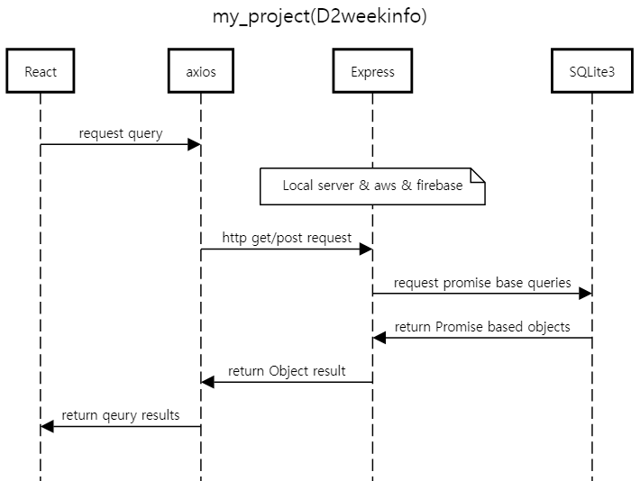

# Destiny2Reset

브렌치 정보
- main : 그날그날 수정하고 작성한 코드가 올라옴
- 날짜 : 뭔가 크게 손을 댔는데 메인에 커밋하기 겁날때 쓰는것

해야하는일
1. express로 구현한 백엔드 API 통신부 수정
   - 기존 : 공격전만 존재
   - 교체 : deepsight.gg의 API를 사용할 예정,주간리셋 모디파이어 테이블을 직접 구현하려니 실력과 시간이 안맞아서 포기
   - 기타 : 꾸준히 알고리즘 공부, 개발 기법 인터넷 검색하고 책으로 공부하기(근데 이건 까먹을꺼 대비해서 정리를 하긴 해야하는데 노트정리가 맞지않나? 굳이 블로그에 올려야할까? 모르겠다)
2. 구현 프레임워크 변경
   - NodeJS => NextJS : express를 썼던 이유는 sqlite3가 NodeJS 환경에서 동작했기 때문
   - API 통신 : 매주 한번씩 갱신해주기, 데이터 결과값은 서버에 일주일 단위로 저장하기
3. 참고중인 사이트
   - https://data.destinysets.com/api : api endpoint & 게임아이템 해쉬값 확인
   - deepsight.gg - ui & ux 현업자 디자인 & manifest 구조 공부

